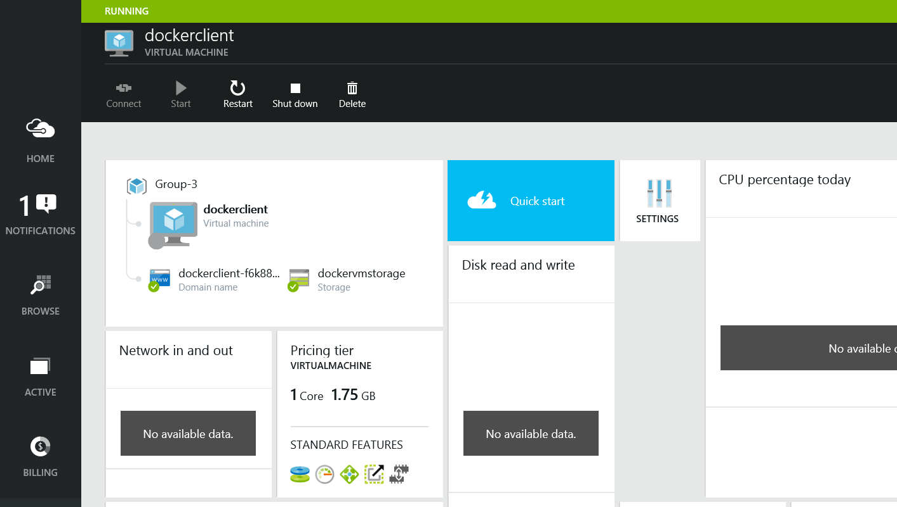

Calling a REST API, running in a Docker container on Azure, directly from Tessel
=============
[Docker] is a tool to manage Linux containers. Containers are processes that have isolated storage, networking and compute resources. Docker is the client tool to create, extend, run and deploy containers. Containers offer a runtime for web applications, services, databases, whatever you can run on Linux (and soon also on Windows). 

Containers are run from Docker images (just like a VM has as a source image file). You can write setup files called Dockerfiles that instruct Docker which steps and commands it should run to build up the image.

###Why care about Containers and Docker? 
Docker makes it very simple to setup environments and make efficient use of the resource a VM has to offer. Once you have a host VM running you can run any number of containers on it and they can start very fast compared to spinning up virtual machines (think sub-second!).

Why would I want to run my container host VM on Azure?
With Microsoft Azure you get a robust platform that let's you (auto)scale you deployments to any size you need with first class tooling (like Visual Studio, Powershell, Puppet, Chef, DSC etc.) and high availability features built-in for both storage and compute. With Azure you also setup for a 99,95% SLA.

So the three selling point for Docker are:
* **Simplified deployment**: Make your images and distribute them within your organization to run on any machine on any platform that has a modern Linux kernel running, again, a Windows version is coming.
* **Efficient use of resources**: Instead of using a VMs as the computing unit we can host multiple Containers in a VM that each act as isolated pseudo VMs.
* Since the VM kernel is shared amongst containers they can run instantly and have a **very small footprint** needing only your application's files and the packages that it depends on.

**Microsoft Azure has full blown support for Linux VM's and therefore is an excellent environment to host containers**. We have built-in support for docker in our cross platform command line tools and VM extensions so setting up Docker hosts on Azure is very easy.

----------------
### What's in this lab?

In this lab we will go through the proces of running a Docker client Linux VM in Azure (or you can use your local Linux environment if have have one already) and provisioning Docker host VM's in which we will run Docker containers. In one of these containers we will run the REST API service created in the 'Websites' lab and connect to it from our Tessel.

Prerequisites
-------------
In order to successfully complete this lab you need to:
* Have successfully setup your Azure Subscription, your development environment and your Tessel according to instructions outlined in the [Setup Lab](../_setup).
* Optionally: Have your own Linux machine or Linux VM available if you prefer a local client. Docker only supports 64-bit operation systems.
* Have the [Putty] and [PuttyGen] tools available for generating an SSH key and accessig the VM.

Instructions
------------
### Setup a docker client VM
* Use PuttyGen to generate a SSH key and a derived key file. We will use these to setup and connect our VM later on.

 
* Create a Linux VM by going to the Microsoft [Azure portal]. Click on the plus icon (New) in lower left corner and select 'Virtual machines' in the Marketplace blade (blades are the sections that build up the horizontal portal segments.

* In the list select 'Everything' so we can use the search feature to look for 'Ubuntu'. This will display all Ubuntu VM images available. Select the one with '14.04 LTS' in its name and press the Create button ast the bottom.

* Configure the VM in the portal wizard so that it is hosted in a nearby region and has the SSH key configured that we generated earlier. Create a new storage account to store the VHD files that our VM machines will be run from. Click 'create' to start provisioning the docker client VM.

* Wait a couple of minutes for the VM to be ready. Check the portal to note the hostname that corresponds to the VM.

* Once the VM gets the 'Running' status use PuTTY to connect to the VM by selecting the private key file in the Category/Connection/SSH/Auth box and entering the host name including the '.cloudapp.net' extensions. It might take a couple of minutes before the connection can be made. In case no connection can be made, double check to see if the hostname got an extension in the name like 'dockerclientvm-**f6k88f4w**' (this would be added for uniqueness in the DNS registery). Also check that you set the Auth keyfile last when using the load/save feature of PuTTY

* Connect to the Linux VM using Putty. 

Update the package manager in the VM and install Node.js using the following commands:

    sudo apt-get update
    sudo apt-get install nodejs-legacy
    sudo apt-get install npm

Install Docker by running: 

    sudo apt-get install docker.io
    
Confirm that Docker is installed buy running the command below  (use 'sudo docker' to see all the commands supported).

    sudo docker version

The result might look something like this:

Let's kick off by running our first container:

    sudo docker run -i -t ubuntu /bin/bash 

This command downloads a standard ubuntu image from the public Docker hub and runs it in a container that is hooked up to the terminal by the '/bin/bash' parameter. Confirm this by checking the prompt stating 'root@[SOME CONTAINERID]'.  

We now have a container running on Azure. Our next step is to build our own image and turn the container running from that image into a Node.js server that serves our REST API to the Tessel.

### Provision a container host in Azure

* Check the installation of the Azure CLI tools by running 'azure' in the terminal.

Make sure you are logged into the Azure portal using the account that is coupled to the subscription you want to use for this lab and run the following command to download the publish settings file containing the subscriptiong belonging to that account. 

    azure account download

If the browser does not start click [this link] to download it manually.

**Optional (Windows OS only):** We can also use the Linux docker client VM , instead of our local machine, to manage Azure. To do so we need to copy the publish settings file we just downloaded to the Linux VM in Azure. Open a command prompt locally (Windows) and run:
 
    set PATH=c:\Program Files(x86)\PuTTY
    pscp -i [PATH TO .PPK FILE] [PATH TO PUBLISH SETTINGS FILE]  [USER NAME]@[HOST NAME].cloudapp.net:/home/[USER NAME]/ 

The tool pscp is part of the PuTTY installation. 
  
Use the next command to install the Azure CLI on the VM or skip this step if you have a local VM running you want to use (assuming you have the CLI tools already installed there).

    sudo npm install -g azure-cli

* Confirm correct installation using the 'azure' command. 

* Now you can use this terminal to run the Azure CLI commands mentioned during the rest of the lab.

Since we have the client tools up and running we want to provision a VM that will act as our Container host. You could also run the Containers locally ofcourse, but in this lab we want to leverage the power of Azure to handle that task on potentialy huge numbers of VMs ranging from small to mega ships of containers, that's where Docker got its name from. To prevent us from having to use the web portal for provisioning virtual machines we use the Azure Cross-Platform Command-Line Interface to handle this from a single command.

Run the statement below to get access to your Azure subscription using the path to the publish settings file.

    azure account import [path to .publishsettings file]
    
Check and set the Azure subscription you want to use:

    azure account list
    azure account set '[SUBSCRIPTION NAME]'

! For reasons unknown to the writer the CLI calls subscriptions 'accounts' but the term account in Azure refers to the Microsoft user account, or organisational Active Directory user, that holds one or more subscriptions:

    
List available Ubuntu images by running:

    azure vm image list | grep 14_04

We filter the list so we only see the latest 14.04 versions of the Ubuntu LTS release that are available in Azure.

Copy the image name of the latest daily build, we will use this in our next command to base the container host VM on.

Enter the command below to create the VM. The 'docker' option instructs Azure to prefit the VM with the Docker components and a docker daemon (background service). -e is the endpoint on port 22, -l is the location 'West Europe' or any region closeby.

    azure vm docker create -e 22 -l "West Europe" [HOST NAME]  "[IMAGE NAME]" [USER NAME] [PASSWORD]

It could be that an error message is show stating the host name is already taken.

After a couple of minutes, we have our host VM running, a storage account for the host VM VHD file, and the certificates for running the Daemon (background service) and have it listen to port 4243.

#### Building & running a container image 
* Make sure the host VM is available by visiting the [Azure portal] and klik the browse button to go to the list of running VM. Select the VM with the hostname we used in the 'azure vm docker create' command. Also note both endpoints created from the command and the CLI tools and the Docker extension.

To make our container available outside of the host we need to add another endpoint for HTTP traffic. Enter: 

	azure vm endpoint create -n "HTTP" "[vmhostname]" 80 80 

This adds the endpoint for HTTP traffic through TCP port 80. You can check the portal website to confirm the creating of the endpoint. the -n is just an endpoint name. The options '80 80' refer to the mapping of an internal port (the one opened in the host VM) and external port (the one we can talk to from our Tessel client). The hostname is the DNS name without the '.cloudapp.net' extensions.

* Check whether our Docker host is running by entering:

	sudo docker --tls -H tcp://[VMHOSTNAME].cloudapp.net:4243 info 

The --tls parameter lets us run a command on the host VM from the client console/terminal and this works because we already have the necessary certificates setup.

To prevent having to type (or copy/paste) the hostname in every command we can add it to an environment variable:

	export DOCKER_HOST="tcp://[VMHOSTNAME].cloudapp.net:4243"

And check if the following return the same result as before:

	docker --tls info

* Let's run a simple container (derived from an ultra-lightweight image called Busybox) in our new dedicated container host to check if it is setup correctly:

	docker --tls run busybox echo hello world
	
We can check all containers on the host using:

	docker --tls ps -a
	
	
We could also use the tls command to setup an image for our container manually but a better, more reusablem, approach would be to define a so called Dockerfile and let Docker manage the creation of the image. The Dockerfile instructs Docker what base image should be used and what command it must execute on top of the base image to create additional layers that ultimately make up the image that has all the parts our app needs to run. In our case this will be Node.js, NPM (the Node.js package manager) and our application script files.

Create a folder named 'tesselapi' and in it a file named 'Dockerfile' on the local machine or the Linux docker client VM (we use PICO as our texteditor):

	cat > Dockerfile
	pico Dockerfile
	
Paste the following script in the Dockerfile: 

	# DOCKER-VERSION .....

	FROM ubuntu:14.04

	# make sure apt is up to date
	RUN apt-get update

	# install Node.js and npm
	RUN apt-get install -y nodejs npm git git-core

	ADD start.sh /tmp/

	RUN chmod +x /tmp/start.sh

	CMD ./tmp/start.sh
	
Save the content of the file by pressing CTRL-O and exit pressing CTRL-X

Add another file called start.sh. The commands in this script file are not cached by Docker (due to the CMD line in the Dockerfile) so we can update these steps faster since they will be executed everytime we 'run' command as we'il see later on.

	cat > start.sh
	pico start.sh
	
Insert the following snippet in the start.sh file. Replace the GITREPO tag with the GIT repository URL (https://github.com/[name]/[REPO].git) that contains the REST API code for our Node.js application.

	cd /tmp

	# try to remove the repo if it already exists
	rm -rf [GITREPO]; true

	git clone [GITREPO]

	cd [GITREPO]

	npm install

	node .

Save the content of the file by pressing CTRL-O and exit pressing CTRL-X.

Run the build proces by initiating the docker 'build' command. Mark the . at the end stating the current directory contains the Dockerfile:

	docker build -t myname/my-nodejs-webserver .

You will see in the terminal that the script is being executed. The script does the following:
* Grab and build on top of the standard Ubuntu image
* Update the package manager in that image
* Install Node.js, NPM and Git
* Add the start.sh file to a temp folder in the container image
* Remove and clone the Git repository containing our REST API code

#### Running the REST API and connecting up the Tessel client

Now we have our REST API running in the Container host on Azure we can setup the Tessel to call it.

Summary
-------
During this lab we have seen that with Docker we can containerize our deployments and thus make more efficient use of our cloud resources in Azure. Containerization enables us to run our application components (API's, Sites, Databases etc.) in lightweight isolated runtimes that are very easy to deploy, interconnect and move to wherever whenever we wish. Containerization can be considered the next step in Platform as a Service and with Azure this scenario is fully supported with Linux and in the near future on Windows VM's as well.
[Azure portal]: http://portal.azure.com
[Docker]: http://www.docker.io/
[Putty]: http://the.earth.li/~sgtatham/putty/latest/x86/putty-0.63-installer.exe
[PuttyGen]: http://the.earth.li/~sgtatham/putty/latest/x86/puttygen.exe
[this link]: http://go.microsoft.com/fwlink/?LinkId=254432
