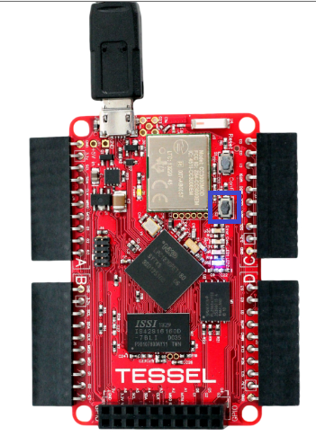

Send messages from Tessel to Service Bus Queue
=============
Asynchronous messaging patterns are the architectural cornerstone of reliable and scalable applications. Integrating cloud resources with Service Bus messaging ensures smooth operation under heavy and variable load with the durability to survive intermittent failures.
In this lab you will learn how to use Service Bus Queue by creating a Tessel app that put (enqueue) messages in a Queue using the REST API, later a consumer app will get (dequeue) the message from the queue using the Azure node.js SDK.
Generally you can read the following article about what is Service Bus Queue and how to use it with node.js [ How to Use Service Bus Queues ](http://azure.microsoft.com/en-us/documentation/articles/service-bus-nodejs-how-to-use-queues/)

Prerequisites
-------------
In order to successfully complete this lab you need to:

* Have successfully setup your Azure Subscription, your development environment and your Tessel according to instructions outlined in the [Setup Lab](../_setup).

Instructions
------------
In this lab you will create a tessel app using the config button on the tessel device. Whenever the button will be pressed a message will be put in ServiceBus queue. Later you will create a node.js app using the Azure node.js SDK to consume the messages from the queue and display the raw message.

### Part 1 - Find the Config button
Before start codeing lets make sure you know which button to press. Take a look at your tessel device and look for the Config button
. 

### Part 2 - Create Service Bus Namespace and Queue, get the authentication credentials
#### Part 2.1 - Create Service Bus Namespace and Queue
The very first thing you will have to do when working with Service Bus is to create a namespace.
Go to the [Azure Managment Portal](https://manage.windowsazure.com/@gwraoa.onmicrosoft.com), in the bottom left corner click the "+NEW" button. Select "APP SERVICES" -> "SERVICE BUS" -> "QUEUE" -> "CUSTOME CREATE".

### Part 2
(Text in part two goes here)

* (Bullet one)
* (Bullet two)
  * (Bullet two point one)
  * (Bullet two point two)

#### Part 2.1
(Text in part two point one goes here)

#### Part 2.2
(Text in part two point two goes here)

#### Part 3
(Text in part three goes here)

	// Use comments in code only if code is otherwise confusing.
	// We want the code to be as good and clean written that it
	// is self-explanatory and doesn't need comments. Still don't
	// be afraid to use comments if needed.

	code.indent(tab); // Indent code with 4 spaces (or tab) to have it appear as code

Summary
-------
(Include a short summary that explains what has been done during the lab. Use a couple of sentences, bullets and other, but don't explain the full lab once again)

(OTHER - REMOVE THIS SECTION)
-----------------------------
(Put whatever code files is needed for the lab directly in the lab's folder or if necessary in sub folders. Also update the main README.md file located in the "labs-folder" and link to this new lab. Make sure to spell check the lab using English US settings.)
