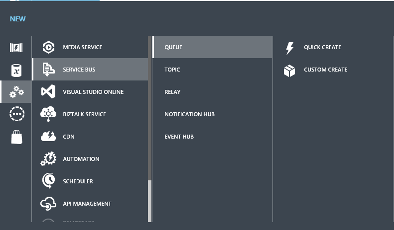
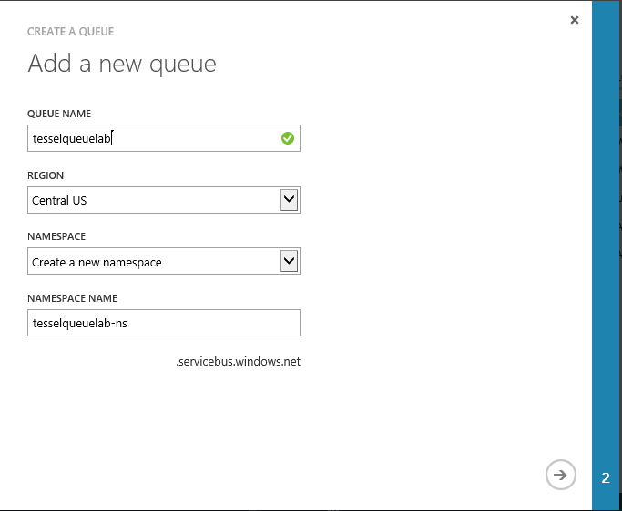
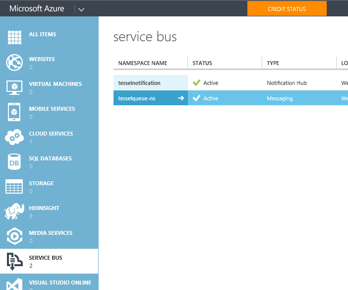
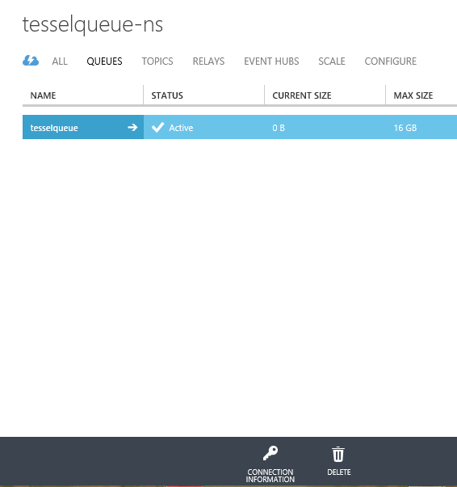
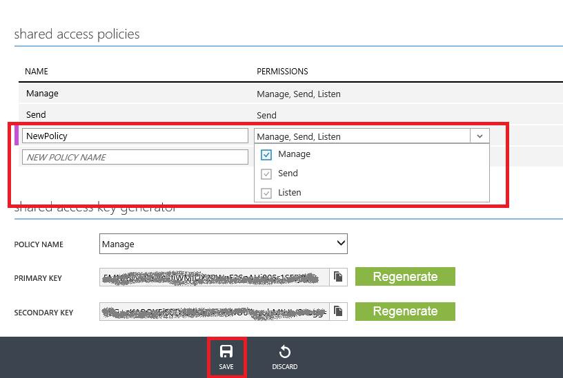
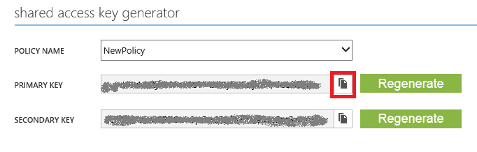
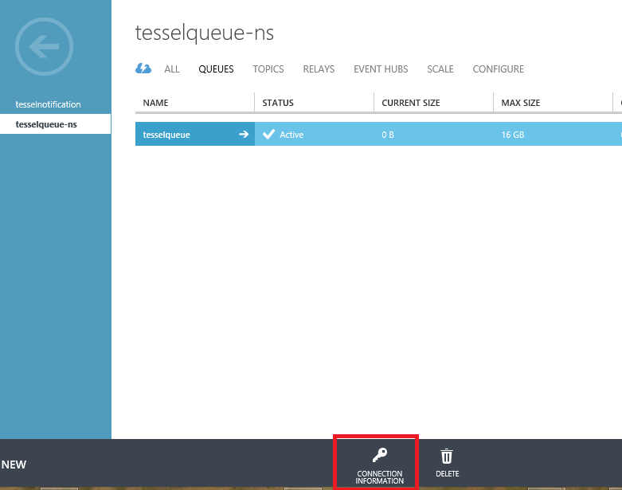
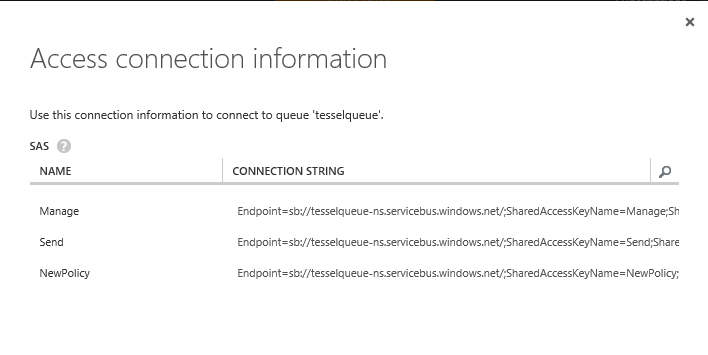

Send messages from Tessel to Service Bus Queue
=============
Asynchronous messaging patterns are the architectural cornerstone of reliable and scalable applications. Integrating cloud resources with Service Bus messaging ensures smooth operation under heavy and variable load with the durability to survive intermittent failures.
In this lab you will learn how to use Service Bus Queue by creating a Tessel app that put (enqueue) messages in a Queue using the REST API, later a consumer app will get (dequeue) the message from the queue using the Azure node.js SDK.
Generally you can read the following article about what is Service Bus Queue and how to use it with node.js [ How to Use Service Bus Queues ](http://azure.microsoft.com/en-us/documentation/articles/service-bus-nodejs-how-to-use-queues/)

Prerequisites
-------------
In order to successfully complete this lab you need to:

* Have successfully setup your Azure Subscription, your development environment and your Tessel according to instructions outlined in the [Setup Lab](../_setup).
* You have installed the [Azure Node.js SDK](http://azure.microsoft.com/en-us/develop/nodejs/)

Instructions
------------
In this lab you will create a tessel app using the config button on the tessel device. Whenever the button will be pressed a message will be put in ServiceBus queue. Later you will create a node.js app using the Azure node.js SDK to consume the messages from the queue and display the raw message.
The code for this lab includes the following files:
* CreateSASToken.js - The code for getting the authentication credentials from ServiceBus
* button_sbqueue_sas.js - The tessel app, whenever the Config button is being pushed a message is sent to the ServiceBus Queue.
* readSBQueue_setconnection.js - Check if there are any message in the ServiceBus Queue and dispaly its raw data.
* ambient_sbqueue_sas.js - This is another example for putting a message in ServiceBus Queue, you can use it if you own the [Tessel Ambient Modole](https://tessel.io/modules#module-ambient), but this is not reqiered in order to complete this lab.

### Part 1 - Find the Config button
* Before start codeing lets make sure you know which button to press. Take a look at your tessel device and look for the Config button. In the picture below the Config button is marked in a blue.

### Part 2 - Create Service Bus Namespace and Queue, Create the authentication credentials
#### Part 2.1 - Create Service Bus Namespace and Queue
* The very first thing you will have to do when working with Service Bus is to create a namespace.
Go to the [Azure Managment Portal](https://manage.windowsazure.com), in the bottom left corner click the "+NEW" button. Select "APP SERVICES" -> "SERVICE BUS" -> "QUEUE" -> "CUSTOME CREATE".

* In the "Add a new queue" dialog box, insert the following details:
  * QUEUE NAME - give a name to your queue
  * REGION - select the nearest region to your location
  * NAMESPACE - select Create a new namespace
  * NAMESPACE NAME - give your namespace a name

#### Part 2.2 - Create the authentication credentials
Applications can authenticate to Microsoft Azure Service Bus using either Shared Access Signature (SAS) authentication, or by authenticating through Microsoft Azure Active Directory Access Control (also known as Access Control Service or ACS). In this lab we use SAS authentication. You will create a SAS Token that you will use later to authenticate from the Tessel device to ServiceBus.

* To create the SAS key go to [Azure Managment Portal](https://manage.windowsazure.com), in the menu on the left scroll down and select "SERVICE BUS".
* Select and press the Namespace you created in part 2.1.

* On the top of the page in the upper menue, select and go to QUEUE.

* Go to the CONFIGURE tab and scroll down to "Shared access policies" 
* Create a new policy by giving it a name and select "manage"
* Save it by presseing the SAVE button at the bottom of the page

* scroll down to "Shared access key generator" 
* Press the image to copy the key near the PRIMARY KEY, this action will copy the key to your clip board
* Save this key, you will use it later in this lab at Part 4.1

### Part 3 - Create the Node.js app to read messages from ServiceBus QUEUE
In this part you will create the consumer app, that read message from the queue and dispaly the message raw data.
Since this app is running on a desktop we will use the [Azure Node.js SDK](http://azure.microsoft.com/en-us/develop/nodejs/).
#### Part 3.1 - Open and Edit the readSBQueue_setconnection.js file
* The source code for this lab includes a file named readSBQueue_setconnection.js. Open this file in a text editor.
* Look for the lines below and edit the details for the ServiceBus connection string (sbConnection) and the Queue name (queue) in the code. 

Look for the following lines in teh code, these are the lines you should edit:

	//var sbConnection = '<your-servicebus-connection-string>';
	//var queue = '<your-queue-name>';

To get the ServiceBus Connection String:
* In the [Azure Managment Portal](https://manage.windowsazure.com) under ServicesBus, Go to your Namespace details and there go to your Queue Details. In the buttom press the button named "CONNECTION INFORMATION".

* Copy the CONNECTION STRING for the policy you created in Part 2.2. This is your connection string.

#### Part 3.2 - Run the readSBQueue_setconnection.js file
Open Node.js command prompt and CD to the location of readSBQueue_setconnection.js. Run the readSBQueue_setconnection.js with node.

	//node readSBQueue_setconnection.js
	
When the app is running it waits for messages in the Queue, when it recives a message it will dispaly its raw data, for example:
	
	//{ body: 'button pressed on tessel',
  	//  brokerProperties:
   	//    { DeliveryCount: 1,
     	//	EnqueuedSequenceNumber: 0,
     	//	EnqueuedTimeUtc: 'Wed, 12 Nov 2014 10:31:36 GMT',
     	//	MessageId: 'dd20ae5468424d7a854baed268d9ee63',
     	//	PartitionKey: '124',
     	//	SequenceNumber: 9288674231451648,
     	//	State: 'Active',
     	//	TimeToLive: 1209600 },
  	//    contentType: 'application/atom+xml;type=entry;charset=utf-8' }
  	
At this point there are not messages in the queue so nothing should be printed to the console. Leave this app running so when you will put messages in the queue from the tessel you'll see it.

#### Part 4 - Get the SAS Token for the Tessel code
In this part you will get the SAS Token you should send for the ServiceBus from the Tessel for authentication.
#### Part 4.1 - Open and Edit the CreateSASToken.js file
* The source code for this lab includes a file named CreateSASToken.js. Open this file in a text editor.
* Look for the lines below and edit the requested details. 
* The AccessKeyName is the POLICY NAME you created in Part 2.2
* The AccessKey is the key you retrived in Part 2.2

Look for the following lines in the code, these are the lines you should edit:

	////ServiceBus parameters
	//var namespace = '<Your-ServiceBus-Namespace>';
	//var queue ='<Your-Queue>';
	//var AccessKeyName = '<Your-AccessKey-Name>';
	//var AccessKey = '<Your-AccessKey>';

#### Part 4.2 - Run the CreateSASToken.js file
Open Node.js command prompt and CD to the location of CreateSASToken.js. Run the CreateSASToken.js with node.

	//node CreateSASToken.js

Copy and save the output string, you will use it in this lab at part 5.

#### Part 5 - 
(Text in part three goes here)

	// Use comments in code only if code is otherwise confusing.
	// We want the code to be as good and clean written that it
	// is self-explanatory and doesn't need comments. Still don't
	// be afraid to use comments if needed.
	//var sbConnection = '<your-servicebus-connection-string>';
	//var queue = '<your-queue-name>';

	code.indent(tab); // Indent code with 4 spaces (or tab) to have it appear as code

#### Part 2.1
(Text in part two point one goes here)

#### Part 2.2
(Text in part two point two goes here)

Summary
-------
(Include a short summary that explains what has been done during the lab. Use a couple of sentences, bullets and other, but don't explain the full lab once again)

(OTHER - REMOVE THIS SECTION)
-----------------------------
(Put whatever code files is needed for the lab directly in the lab's folder or if necessary in sub folders. Also update the main README.md file located in the "labs-folder" and link to this new lab. Make sure to spell check the lab using English US settings.)
